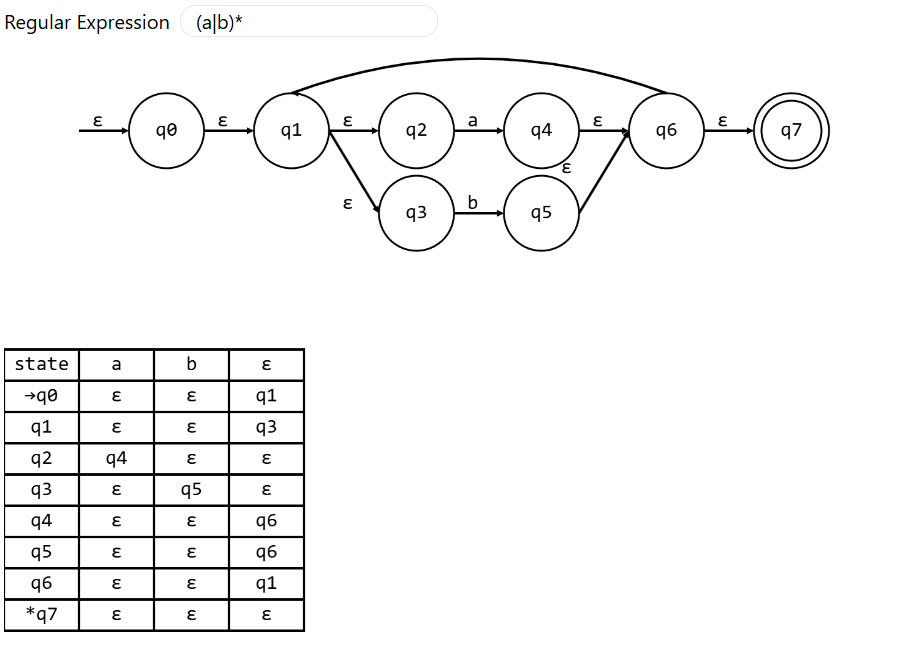

# Regular Expression to Finite Automaton &middot;  
This is an application both accessible on web and mobile. The purpose of this simple application is to render a given regular expression to a finite automaton diagram. This uses the Thompson Construction algorithm for the diagram generation along with the Shunting Yard algorithm to convert the infix input to postfix.

## Web
The web application is a [Node.js](https://nodejs.org/) application. This is where the entire application was originally developed using the native HTML5 Canvas API. It is written to be as efficient as possible while rerendering in real-time.

Provided below is a screenshot taken of the working web-application.

## Mobile
The mobile application is a Flutter application. It uses a CustomPainter which s extremely similar to the HTML5 Canvas API.

## Improvements
This is open to improvements particularly in rendering union operations denoted by "+". The mobile application is also open to interface and interaction imporovements.